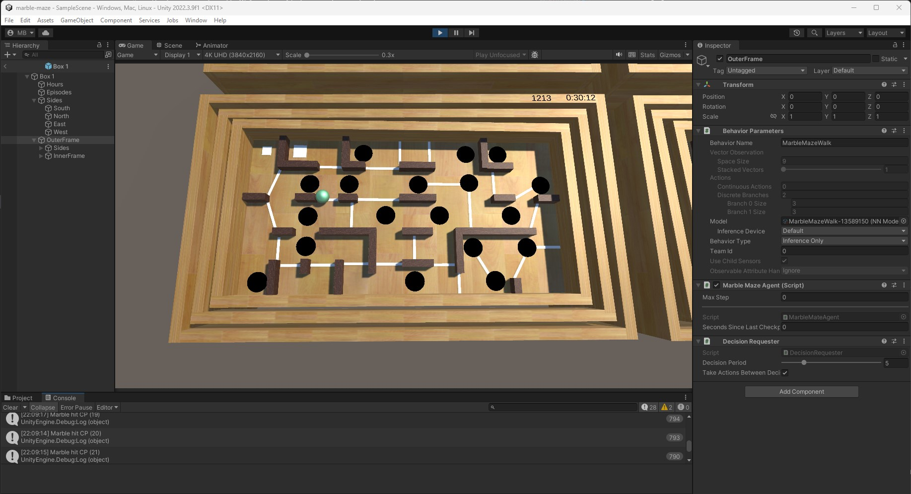

# marble-maze
Unity project with MLAgents. AI learns to control a marble in a maze. There's a youtube [video](https://www.youtube.com/watch?v=cCJV7BnXND8) with the result.

## Overview

In this project a model can be trained to tilt the two planes of a maze, so that a marble finds its way to the target. The project has been developed with Unity and ML Agents.

### requirements

I used the following setup on Windows 11:
- Unity Hub 3.5.2 + Unity Editor 2022.03.9f1
- Unity Asset [15 Original Wood Texture]("https://assetstore.unity.com/packages/2d/textures-materials/wood/15-original-wood-texture-71286")
- Python 3.9.6
- PyTorch: 1.7.1+cu110 
- ml-agents: 0.30.0

## getting started

- clone this repository: `git clone https://github.com/stevens68/marble-maze.git`

#### Open the project in Unity
- Start Unity Hub and select `Installs`
- Install Unity Editor 2022.039f1 if necessary
- Select `Projects`
- Click `Open` -> `Add project from disk`, select the project directory 
Unity Editor will start and import necessary packages like `MLAgents` and `TextMeshPro`

#### Install Unity Asset [15 Original Wood Texture]("https://assetstore.unity.com/packages/2d/textures-materials/wood/15-original-wood-texture-71286)

- Open the Unity Asset Store with the link above (you might need to Login)
- Click `Open Asset in Unity`
- in the Package Manager, select `15 Original Wood Texture` and click `Download`
- in the Package Manager, when download is complete, click `Import`
- After successful import, you should see a folder `Assets/Original Wood Texture` in the project tab
- close the Package Manager

#### Add textures to the maze
- In the project tab, open folder `Assets/_marble-maze/prefabs` and double click on `Box 1`
- In the project tab, open folder `Asset/Original Wood Texture/Wood Texture 13`  
- Select the following parts of `Box 1` and drag `Wood Texture 13 (diffuse)` to the inspector tab:
  - `Box 1/Sides/*`
  - `Box 1/Outer Frame/Sides/*`
  - `Box 1/Outer Frame/Inner Frame/Sides/*`
  - `Box 1/Outer Frame/Inner Frame/Board`
- Select the following parts of `Box 1` and drag `Wood Texture 06 (diffuse)` to the inspector tab:
  - `Box 1/Outer Frame/Inner Frame/Walls/*`

## Running a model (inference)

I put a trained model in this repository that can be used for inference. It's not 
perfect though, i.e. the marble will reach the target in many but not all runs.

To run the model, open Unity Editor
- Double click `Assets/_marble-maze/prefab/Box 1` in the project tab
- In the hierarchy tab, select `Box 1/Outer Frame`
- In the project tab, open `Asstes/_marble-maze/model`
- Drag `MarbleMazeWalk` to the `Model` field in section `Behaviour Parameters` in the isnspector tab
- Select `Behaviour Type` = `Inference only`
- Select the `Game` view and click the `Play`-Button
- After a few seconds, you should see the marble starting to run

## Training

### Install ml-agents

- Make sure, Python is installed (install it if necessary; version 3.9 recommended) 
  `> python --version`
- Make sure the pip module is installed 
  `> python -m ensurepip --upgrade`
- Make sure the venv module is installed 
  `> pip install venv`
- In the project directory (`marble-maze`), create a virtual environment 
  `> python -m venv myvenv`
- Activate the virtual environment 
  `> myvenv\Scripts\activate`
- Install PyTorch in myvenv 
  `(myvenv) > pip install torch==1.7.1`
- Install ML Agents in myvenv 
  `(myvenv) > pip install ml-agents==0.30.0`
- Check installation 
  `(myvenv) > mlagents-learn --help`
- In case of errors, install the following modules in myvenv and check again 
  `(myvenv) > pip install protobuf==3.20` 
  `(myvenv) > pip install six`

### Start a training run

- In Unity editor, make sure that prefab `Box 1/Outer Frame` has `Behaviour Type` = `Default` (not `Inference only`)
- In the virtual environment, to start training run `r101` 
  `(myvenv) > mlagents-learn --run-id=r101 config\marble-maze.yaml` 
  This will start a server lstening on port 5004 by default
- In Unity Editor `Game` view, press the `Play`-Button 
  This will start the training with 32 mazes in parallel
- Check the progress:
  - `mlagents-learn` log output for average total reward
  - Unity Editor console tab (collapsed) for number of hits per checkpoint

### Stop a training run

- Press `Ctrl-C` in the command window where you started `mlagents-learn`

### Resume a training run

- In the virtual environment, to resume training run `r101`
  `(myvenv) > mlagents-learn --run-id=r101 --resume` 

### Adjust meta-parameters

- Create a copy of `config\marble-maze.yaml` and edit the parameters
- Start a new training run with the new config file

## Reinforcement-Learning

### actions

The two planes can be controlled by the ML agent independantly, i.e. they are tilted around their middle axis in steps of &#xB1;0.1° up to &#xB1;1.5° max. The action space is discrete, shape (2, 3): 
- 1st dimension: 0 = no change, 1 = tilt up, 2 = tilt down
- 2nd dimension: 0 = no change, 1 = tilt left, 2 = tilt right

### states

The ML Agent receives the state of the marble. The state space is continuous, shape (3, 3):
- 1st dimension: position (x, y, z)
- 2nd dimension: angular velocity (x, y, z)
- 3rd dimension: velocity (x, y, z)

Note, that the tilt angle of the planes is not part of a state.

### rewards

The ML Agent receives rewards / penalties
- -5 for hitting a hole
- +10 for hitting a checkpoint (white bar)
- -0.005 per timestep

Note: the penalty per timestep encourages the ML Agent to find a fast and direct path through the maze.

### episodes

Each episode starts with the marble in the top left corner. The start position is randomly changed each time up to &#xB1;0.003 in x- and y-dimension. An episode ends if,
- the marble hits a hole
- the marble hits the target
- the marble has not hit the next checkpoint within 6 seconds since the last checkpoint

Note: the checkpoints are necessary to reward small progress steps rather than rewarding the final target only. 

